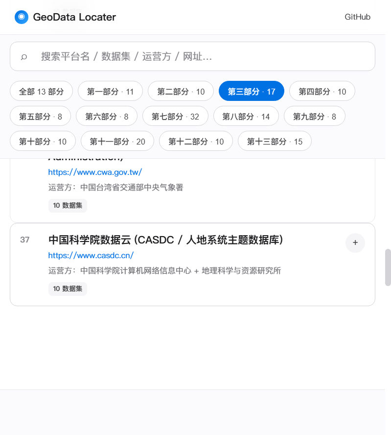

# GeoData Locater · 国内外遥感数据网站合集

> 📡 **173 个数据平台 · 1730 个代表数据集 · 13 个主题部分** · 2026 年 8 月版

[](https://haorantang1999.github.io/GeoData_Locater/)
[]()
[]()

SCI 遥感论文常用的数据存储库、国内国家级数据中心、中科院各所与高校遥感团队、日本及其他国家官方数据、AI/ML 平台、商业卫星公司开放数据 —— **一站式覆盖遥感科研数据全谱系**。

**🍎 苹果极简风网页** · GitHub Pages 静态部署 · 全静态、无后端 · ⌘/Ctrl+K 全局搜索

---

## 📸 网站预览

**首页概览**（173 平台 · 1730 数据集 · 13 部分）：


**第三部分：国内国家级科学数据中心**（含香港天文台 HKO / 香港 CSDI Portal / 澳门 SMG / 中国台湾省 CWA 四个港澳台官方数据站 + 中科院数据云 CASDC，点击"第三部分 · 17"筛选可见）：



> 访问在线版 → https://haorantang1999.github.io/GeoData_Locater/

---

## 📂 仓库结构

```
GeoData_Locater/
├── index.html            # 主页面（单页应用）
├── style.css             # 苹果风样式（含暗色模式 / 响应式）
├── app.js                # 渲染 / 搜索 / 过滤 / 展开逻辑
├── data.js               # 173 平台 / 1730 数据集（从 markdown 自动生成）
├── 国内外地理遥感数据网站合集.md  # 源文档（中文 markdown 全文）
├── parse_md.py           # markdown → data.js 转换脚本
├── audit.py              # 数据完整性审计（0 错标准）
├── check_urls.py         # 批量 URL 可达性检查
├── url_check_result.json # URL 检查结果
├── assets/
│   ├── screenshot-hero.png  # 本 README 首页预览图（173 / 1730）
│   ├── screenshot-part3.png # Part 3 国内国家级 + 港澳台 4 站截图
│   └── logo.png             # 项目 logo
├── .nojekyll             # 防止 GitHub Pages 用 Jekyll 编译
├── .github/workflows/
│   └── deploy.yml        # 自动部署到 GitHub Pages
└── README.md             # 本文件
```

---

## 🚀 GitHub Pages 部署

### 方式一：直接 fork + 自动部署（推荐）

1. **Fork** 本仓库到你的 GitHub 账号
2. 仓库 → **Settings → Pages**：
   - Source: **GitHub Actions** （自动检测到 `.github/workflows/deploy.yml`）
3. push 任意 commit 到 `main` 分支，GitHub Actions 自动构建并部署
4. 1-2 分钟后访问 `https://<你的用户名>.github.io/GeoData_Locater/`

### 方式二：手动部署

1. **Settings → Pages**：
   - Source: `Deploy from a branch`
   - Branch: `main` / `(root)`  ← 根目录直接放静态文件
2. push 即可

### 工作流说明

`.github/workflows/deploy.yml` 使用官方 `actions/deploy-pages@v4`，把仓库根目录作为部署源（**不再需要 `website/` 子目录**）。

---

## 🛠 维护与更新

### 1. 编辑 markdown 源文档

`国内外地理遥感数据网站合集.md` 是源文件，手工编辑即可。**每个平台条目格式**：

```markdown
### 编号. 平台名（英文/缩写）

- **网址**：<https://example.com/>
- **运营方**：XXX 单位
- **特点**：**核心特点** + 引用场景描述。
- **标志性数据集**：该平台最有影响力的 2-4 个数据集（名称 + 出品方/年份 + 一句话定位与引用量）。

**10 个代表性数据集**：

1. **数据集 1 名**：<https://...>
2. ...
10. ...
```

### 2. 重新生成 data.js

```bash
python parse_md.py
```

输出：`解析完成：13 个部分，173 个网站，1730 个数据集`

### 3. 审计数据完整性

```bash
python audit.py
```

标准：**0 错**（不能有缺网址 / 缺运营方 / 缺数据集的条目）

### 4. 批量 URL 检查

```bash
python -u check_urls.py
```

自动 HEAD 测试所有 URL，自动 GET 兜底（HEAD 403/405 时），结果写入 `url_check_result.json`。

### 5. 重新部署

```bash
git add .
git commit -m "更新数据 $(date +%Y-%m-%d)"
git push
```

GitHub Actions 自动部署，1-2 分钟生效。

---

## 🎨 网页功能

- **🔍 全局搜索**：支持按平台名 / 运营方 / 数据集 / 网址 全文搜索
- **🎯 主题过滤**：13 个主题部分可单独筛选
- **📂 卡片展开**：每个平台默认折叠，点击展开 10 个代表数据集
- **⌨️ 快捷键**：`⌘/Ctrl + K` 聚焦搜索框；`Esc` 重置
- **🌗 暗色模式**：跟随系统 `prefers-color-color-scheme`
- **📱 响应式**：桌面 / 平板 / 手机自适应

---

## 📊 数据规模一览（2026-08-11 版）

| 部分 | 平台 | 数据集 |
|---|---:|---:|
| 第一部分：SCI 论文高频使用的国际数据存储库 | 11 | 110 |
| 第二部分：国际官方卫星 / 遥感数据中心 | 10 | 100 |
| 第三部分：国内国家级科学数据中心（含港澳台 4 站 + 中科院数据云 CASDC） | 17 | 170 |
| 第四部分：国内专门遥感 / 卫星数据平台 | 10 | 100 |
| 第五部分：国内高校 / 科研机构专题遥感数据集 | 8 | 80 |
| 第六部分：日本官方遥感数据 | 8 | 80 |
| 第七部分：其他国家官方遥感数据 | 32 | 320 |
| 第八部分：SCI 论文配套数据存储库 | 14 | 140 |
| 第九部分：跨库检索 / 元数据聚合 | 8 | 80 |
| 第十部分：AI / ML 时代新平台 | 10 | 100 |
| 第十一部分：国内中科院各所 + 高校遥感团队专题 | 20 | 200 |
| 第十二部分：国内行业部门专题 | 10 | 100 |
| 第十三部分：商业卫星公司开放数据集 | 15 | 150 |
| **合计** | **173** | **1,730** |

### 已覆盖的国家 / 地区级官方机构

| 类别 | 包含 |
|------|------|
| 大陆国家级 | 国家青藏高原 / 地球系统 / 气象 / 风云卫星 / 林草 / 生态 / 冰川冻土沙漠 / 海洋 / 极地 / 地震 / 农业 / 基础学科 12 个数据中心 |
| 港澳台 | 香港天文台 HKO、香港 CSDI Portal、澳门 SMG、中国台湾省中央气象署 CWA |
| 国际机构 | NASA、ESA、EUMETSAT、NOAA、JAXA、JMA、ISRO、CNES、DLR、KMA、UK Met Office、Copernicus、SERVIR、WMO、GEO 等 |
| 中科院系列 | 空天院、地理所、青藏所、南湖所、东北地理所、西北高原所、华南植物园、大气物理所、紫金山天文台、上海天文台、国家天文台、国家授时中心等 20+ 个 |
| 高校团队 | 武大、清华、北师大、同济、中山、中国地大、华东师大、南大、南信大、西大、长安大、中国农大、中国海大、哈工大、国防科大、北大、北林大等 20+ 个 |

---

## 🛡 致谢与声明

- 整理人：**Mavis (Mavis Code Agent)**
- 数据更新：2026-08-11
- 引用建议：本文档为非正式整理版本，使用前请按"**网址 + DOI**"双重验证最新可用性
- License：MIT
- 部署：GitHub Pages + GitHub Actions

---

## 🔗 相关链接

- 🌍 在线浏览：https://haorantang1999.github.io/GeoData_Locater/
- 📦 GitHub 仓库：https://github.com/haorantang1999/GeoData_Locater
- 📝 源文档：`国内外地理遥感数据网站合集.md`（同仓库根目录）


